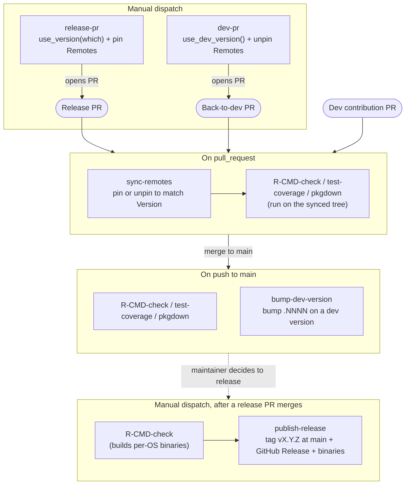

# Workflows

Reusable workflows (e.g. GitHub Actions) which can be used in any OSP repository.

See https://docs.github.com/en/actions/using-workflows/reusing-workflows for details on how reusable workflows are called.

This repository hosts workflows for several purposes (content checks, spell checking, link checking, CodeQL, qualification plans, and more).


## OSP R package CI

This is a suggested, complete GitHub Actions setup for an OSP R package: a reference wiring of focused, event-specific reusable workflows that together cover the full lifecycle of the package, from validating pull requests, to advancing the development version on merge, to preparing and publishing releases. Adopt it wholesale, or take the pieces you need; a consuming repository wires a handful of thin caller workflows that delegate to the reusable ones below rather than maintaining its own CI logic.


### The reusable workflows

| Workflow | Trigger it is wired to | What it does |
| --- | --- | --- |
| `sync-remotes.yaml` | `pull_request` | Pins (`@*release`) or unpins `Remotes:` in DESCRIPTION to match the package Version, and commits the fix back to the PR branch so the merged tree carries the right pin. |
| `bump-dev-version.yaml` | `push` to default branch | On a dev version (`x.y.z.NNNN`), increments the trailing component and commits it. Release versions are a no-op. |
| `release-pr.yaml` | `workflow_dispatch` | Runs `usethis::use_version(which)`, pins Remotes to `@*release`, and opens a `release-pr-<version>` PR. |
| `dev-pr.yaml` | `release` (published) / dispatch | Runs `usethis::use_dev_version()`, unpins Remotes, and opens a `dev-pr-<version>` PR (restores development mode after a release). |
| `publish-release.yaml` | `workflow_dispatch` (after a release PR merges) | Force-tags `vX.Y.Z` at the current commit and creates/updates the GitHub Release, with notes from NEWS.md and the per-OS binaries from the same run attached. Dev versions are skipped. |
| `R-CMD-check-build.yaml` | `pull_request`, `push`, dispatch | Runs `R CMD check` across the OS matrix; optionally builds and uploads the per-OS binary packages that `publish-release` attaches. |
| `R-CMD-check-released-deps.yaml` | scheduled / dispatch | Runs `R CMD check` with Remotes pinned to `@*release`, i.e. against the latest **released** OSP dependencies. |
| `test-coverage.yaml` | `pull_request`, `push` | Computes coverage with `covr` and uploads to Codecov. |
| `pkgdown.yaml` | `pull_request`, `push` | Builds the pkgdown site; deploys to GitHub Pages on non-PR events. |

### Setting up a consuming repository

Add the caller workflows below under `.github/workflows/` in your package repository. They reference the reusable workflows at `@main`; pin to a tag or commit SHA for reproducibility. The diagram shows how the caller workflows articulate across PR, merge, and release events.


#### Prerequisites

Configure these in the consuming repository (Settings → Secrets and variables → Actions). Only `CODECOV_TOKEN` is needed in the common case; the GitHub App credentials are conditional (see below).

| Kind | Name | Used by | Purpose |
| --- | --- | --- | --- |
| Secret | `CODECOV_TOKEN` | `test-coverage` | Codecov upload token. Needed only if you keep the `test-coverage` job. |

##### GitHub App credentials (optional, see when they are needed)

`bump-dev-version`, `release-pr`, and `dev-pr` all default to the built-in `GITHUB_TOKEN`, so the simplest setup needs no App at all. A GitHub App is worth adding for two reasons, each affecting different workflows:

1. **Pushing to a protected default branch (`bump-dev-version`).** This workflow pushes the dev-version bump commit *directly* to the default branch. If that branch is protected by a ruleset, a commit pushed with `GITHUB_TOKEN` is rejected. A token minted from an App that the ruleset allows to bypass is not, so the App is required here only when the default branch is protected.
2. **Letting the opened PR trigger CI (`release-pr`, `dev-pr`).** These push a feature branch and open a PR, both of which `GITHUB_TOKEN` *can* do. The catch is that GitHub does not run workflows in response to events caused by `GITHUB_TOKEN` (a deliberate loop guard), so a PR opened with it sits there with no `pull-request.yaml` run. Opening the PR with an App token makes it trigger the normal PR pipeline, so the release/dev candidate is actually validated before merge.

To use an App, provision it and wire the credentials:

1. Create (or reuse) a GitHub App, install it on the repository, and grant it `contents: write` and `pull-requests: write`.
2. **Only for the protected-branch case above:** add the App to the default branch ruleset's bypass list (Settings → Rules → Rulesets → your default-branch ruleset → Bypass list). Without this, its token is still rejected by the protection.
3. Add its credentials:

| Kind | Name | Purpose |
| --- | --- | --- |
| Variable | `APP_CLIENT_ID` | Client ID (or App ID) of that App. |
| Secret | `APP_PRIVATE_KEY` | Private key (PEM) of that App. |

`APP_CLIENT_ID` and `APP_PRIVATE_KEY` are placeholders. Name them whatever you like and reference those names in the `with:` / `secrets:` blocks of the templates below. Leave the `client-id` / `private-key` inputs unset (omit them from the caller) to fall back to `GITHUB_TOKEN`.

> The release/dev/bump workflows accept the App identity via the `client-id` input. The older `app-id` input still works (it is accepted as a deprecated alias), but new callers should pass `client-id`.

Each caller is a thin file. Click to expand the one you need and copy it into `.github/workflows/`. In the `merge-to-main`, `release-pr`, and `dev-pr` templates, the `client-id:` / `private-key:` lines drive the App token; drop them to fall back to `GITHUB_TOKEN` (see the App-credentials note above for the trade-offs).

<details>
<summary><code>pull-request.yaml</code>: runs on every PR</summary>

```yaml
name: Pull Request Workflow

on:
  pull_request:

permissions: read-all

jobs:
  sync-remotes:
    permissions:
      contents: write # commits the synced Remotes back to the PR branch
    uses: Open-Systems-Pharmacology/Workflows/.github/workflows/sync-remotes.yaml@main
    secrets: inherit

  R-CMD-Check:
    needs: [sync-remotes]
    if: ${{ !cancelled() && needs.sync-remotes.result != 'failure' }} # a skipped fork-PR sync must not block the check, but a failure should
    uses: Open-Systems-Pharmacology/Workflows/.github/workflows/R-CMD-check-build.yaml@main

  test-coverage:
    needs: [sync-remotes]
    if: ${{ !cancelled() && needs.sync-remotes.result != 'failure' }}
    uses: Open-Systems-Pharmacology/Workflows/.github/workflows/test-coverage.yaml@main
    secrets:
      CODECOV_TOKEN: ${{ secrets.CODECOV_TOKEN }}

  pkgdown:
    needs: [sync-remotes]
    if: ${{ !cancelled() && needs.sync-remotes.result != 'failure' }}
    permissions:
      contents: write # required by the pkgdown reusable workflow (no deploy on PRs)
      pull-requests: read # the workflow's change-detection job reads PR file changes
    uses: Open-Systems-Pharmacology/Workflows/.github/workflows/pkgdown.yaml@main
```

</details>

<details>
<summary><code>merge-to-main.yaml</code>: runs on push to the default branch</summary>

```yaml
name: Merge to Main Workflow

on:
  push:
    branches: [main]

permissions: read-all

jobs:
  bump-dev-version:
    permissions:
      contents: write # pushes the dev-version bump to main
    uses: Open-Systems-Pharmacology/Workflows/.github/workflows/bump-dev-version.yaml@main
    with:
      client-id: ${{ vars.APP_CLIENT_ID }}
    secrets:
      private-key: ${{ secrets.APP_PRIVATE_KEY }}

  R-CMD-Check:
    if: ${{ !cancelled() }}
    uses: Open-Systems-Pharmacology/Workflows/.github/workflows/R-CMD-check-build.yaml@main

  test-coverage:
    if: ${{ !cancelled() }}
    uses: Open-Systems-Pharmacology/Workflows/.github/workflows/test-coverage.yaml@main
    secrets:
      CODECOV_TOKEN: ${{ secrets.CODECOV_TOKEN }}

  pkgdown:
    if: ${{ !cancelled() }}
    permissions:
      contents: write # deploys the built pkgdown site
      pull-requests: read
    uses: Open-Systems-Pharmacology/Workflows/.github/workflows/pkgdown.yaml@main
```

</details>

<details>
<summary><code>release-pr.yaml</code>: manual dispatch, opens a release PR</summary>

```yaml
name: Release PR

on:
  workflow_dispatch:
    inputs:
      which:
        description: 'Which component to bump for the release.'
        required: true
        type: choice
        options: [patch, minor, major]
        default: patch

permissions:
  contents: write
  pull-requests: write

jobs:
  release-pr:
    uses: Open-Systems-Pharmacology/Workflows/.github/workflows/release-pr.yaml@main
    with:
      which: ${{ inputs.which }}
      client-id: ${{ vars.APP_CLIENT_ID }}
    secrets:
      private-key: ${{ secrets.APP_PRIVATE_KEY }}
```

</details>

<details>
<summary><code>dev-pr.yaml</code>: restores development mode after a release</summary>

```yaml
name: Dev PR

on:
  release:
    types: [published] # auto-open the restore-development PR once a release is published
  workflow_dispatch: # or run it by hand

permissions:
  contents: write
  pull-requests: write

jobs:
  dev-pr:
    uses: Open-Systems-Pharmacology/Workflows/.github/workflows/dev-pr.yaml@main
    with:
      client-id: ${{ vars.APP_CLIENT_ID }}
    secrets:
      private-key: ${{ secrets.APP_PRIVATE_KEY }}
```

</details>

<details>
<summary><code>publish.yaml</code>: manual dispatch, tags and publishes the release</summary>

```yaml
name: Publish Release Workflow

on:
  workflow_dispatch:

permissions: read-all

jobs:
  guard-branch:
    runs-on: ubuntu-latest
    steps:
      - name: Ensure the workflow runs from main
        if: ${{ github.ref != 'refs/heads/main' }}
        env:
          REF_NAME: ${{ github.ref_name }}
        run: |
          echo "::error::This workflow must be run from the 'main' branch, but it was dispatched from '${REF_NAME}'. Re-run it with 'main' selected as the branch."
          exit 1

  R-CMD-Check:
    needs: [guard-branch]
    uses: Open-Systems-Pharmacology/Workflows/.github/workflows/R-CMD-check-build.yaml@main

  publish-release:
    needs: [guard-branch, R-CMD-Check]
    permissions:
      contents: write # force-tags vX.Y.Z and creates/updates the GitHub Release
      actions: read # download-artifact reads the run's binaries
    uses: Open-Systems-Pharmacology/Workflows/.github/workflows/publish-release.yaml@main
```

</details>

#### How it fits together




### Nightly dependency checks (Remotes-based packages only)

These two scheduled checks are specific to packages that resolve some dependencies from GitHub via `Remotes:` in DESCRIPTION (typically OSP packages that depend on other OSP packages not published on CRAN). A package whose dependencies all come from CRAN has nothing to gain here and should skip this section.

The pair catches drift in both directions: `check-dev-deps` checks against the current development dependencies (the unpinned Remotes as they stand in DESCRIPTION), while `check-released-deps` pins Remotes to `@*release` and checks against the latest released ones. Running both nightly surfaces a break early, whether it comes from an upstream development change or from a not-yet-released upstream fix the package has started relying on.

<details>
<summary><code>check-released-deps.yaml</code></summary>

```yaml
name: Check against released dependencies

on:
  schedule:
    - cron: '0 3 * * *'
  workflow_dispatch:

permissions: read-all

jobs:
  check-released-deps:
    uses: Open-Systems-Pharmacology/Workflows/.github/workflows/R-CMD-check-released-deps.yaml@main
```

</details>

<details>
<summary><code>check-dev-deps.yaml</code></summary>

```yaml
name: Check against development dependencies

on:
  schedule:
    - cron: '0 4 * * *'
  workflow_dispatch:

permissions: read-all

jobs:
  check-dev-deps:
    uses: Open-Systems-Pharmacology/Workflows/.github/workflows/R-CMD-check-build.yaml@main
```

</details>
